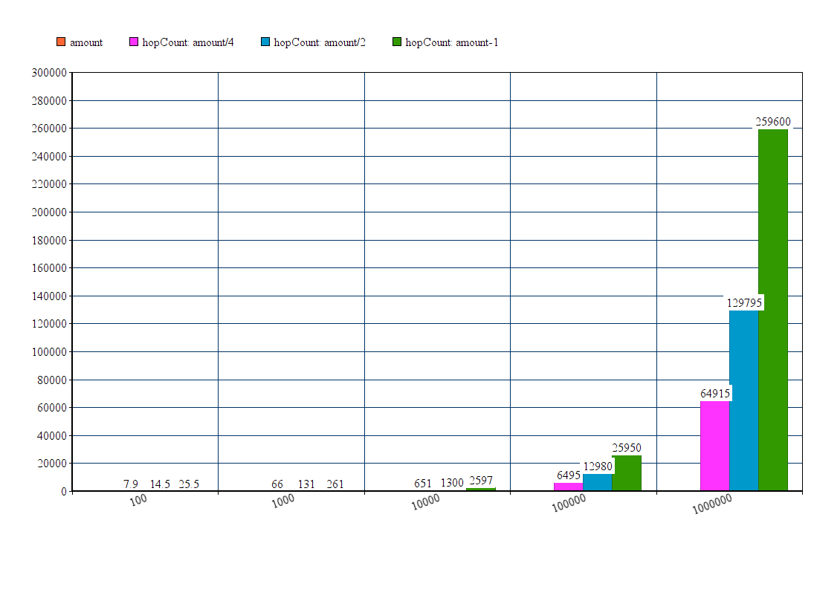

# Testausdokumentti

Testit löytyvät tests kansiosta. Jokaiselle object luokalle on oma yksikkötesti tiedostonsa. Näiden lisäksi reititykselle on tehty integraatiotestejä sekä koko ohjelmaa testaava integraatiotesti performanceTest.

Yksikkötestit on tehty CMocka kirjaston avulla. Tests kansiosta löytyy scripti buildUnitTests.sh näiden rakentamiseen johon vaaditaan gcc ja CMocka kirjasto. 

performanceTest ei vaadi lähdekoodin lisäksi mitään muita kirjastoja ja sen rakentamiselle löytyy scipti buildPerformanceTest.sh tests kansiosta.

## Verkon generoinnin testaus

Verkon generoiti on testattu yksikkötesteillä sekä integraatiotestillä performanceTest. Reitinetsintä testaa myös verkon yhtenäistyyttä. 

## Reitinetsinnän testaus

routingTests luokassa on reitityksen yksikkötestit sekä laajempia sen toimivuuteen liittyviä testejä. Reititys on testattu tuhansia kertoja viimeiseen ja/tai satunnaiseen solmuun verkon koilla 100, 1000, 2000 sekä 2 000 000. Näissä kaikissa tapauksissa hopCountin arvo oli enintään verkon koko, joten näillä arvoilla reitinetsintä toimii ainakin ajassa O(|V|+|G|). 1000+ solmun verkoissa reitinetsintä toimi tuhansilla testikerroilla myöskin hopCountilla V/2, eli ajassa O(|V|/2 + |G|).

Yli 2 000 000 solmun verkkoja ei ole testattu. Alle 100 solmun verkoissa hopCount joka on verkon solmujen lukumäärä ei kaikissa tapauksissa riittänyt (useimmissa kyllä). Verkon solmujen lukumäärän ollessa kymmenen, hopCountin täytyy pahimmissa tapauksissa olla kaksinkertainen.

## performanceTest

Integraatiotesti luo 20 kertaa 100, 1000, 10000, 100000 ja 1 000 000 kokoisen verkon, josta se laskee kullekkin keskimääräisen hopCountin ja verkon luomiseen käytetyn ajan. 

<b>Useamman testin keskimääräiset tulokset:</b>

